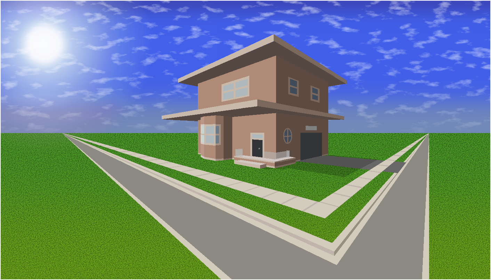
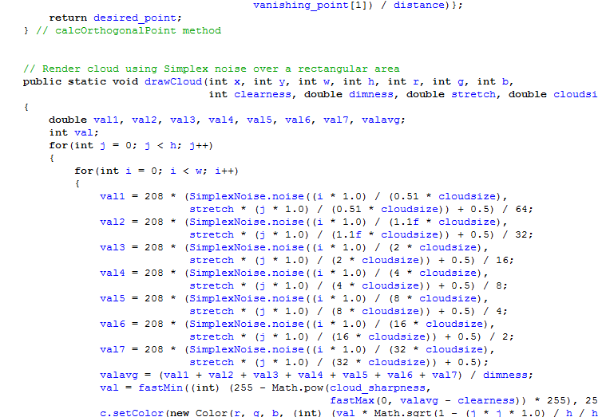
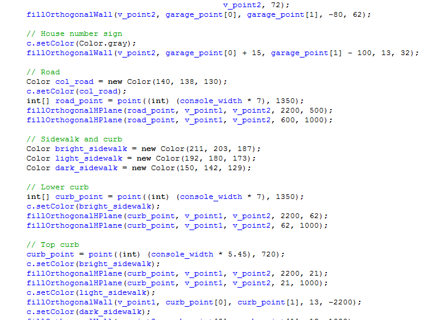

# Photorealistic-Renders
Photorealistic Java renders of a house and a moon.

## Screenshots

Using a Java Simplex noise library, I created these two renders in Java. 

I made wrote a library to render objects in two-point perspective and made this house render below:

I also made an image of the night-time skyline of Toronto with an abnormally large moon. The Milky way galaxy is in the background.

## Source code

Implementing Simplex noise was well, not exactly pretty.

`fillOrthogonalWall`? `fillOrthogonalHPlane`? Why???

### Installation

Email me if you want the full source code!

You will need [Ready to Program's](http://compsci.ca/holtsoft/) HSA libraries to run the software.
