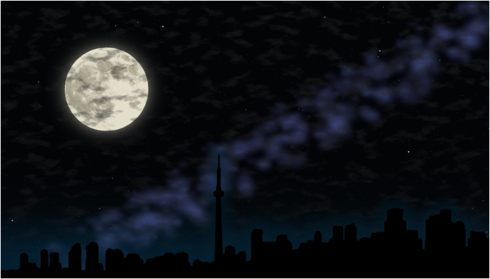

# Photorealistic-Renders
Photorealistic Java renders of a house and a moon.

## Screenshots

Using a Java Simplex noise library, I created these two renders in Java. 

I made wrote a library to render objects in two-point perspective and made this house render below:

I also made an image of the night-time skyline of Toronto with an abnormally large moon. The Milky way galaxy is in the background.

## Source code

Implementing Simplex noise was well, not exactly pretty.

Writing the library functions to render the house in two-point perspective was quite fun at the time.
But looking back, some of the method names are a bit eccentric.

`fillOrthogonalWall`? `fillOrthogonalHPlane`? Why???

### Installation

Email me if you want the full source code!

You will need [Ready to Program's](http://compsci.ca/holtsoft/) HSA libraries to run the software.

## Sources
(http://webstaff.itn.liu.se/~stegu/simplexnoise/simplexnoise.pdf)

(http://mrl.nyu.edu/~perlin/flownoise-talk/)

(http://www.riemers.net/eng/Tutorials/XNA/Csharp/Series4/Perlin_noise.php)
